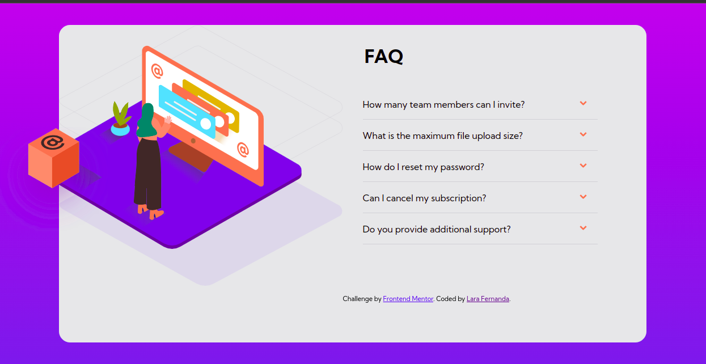
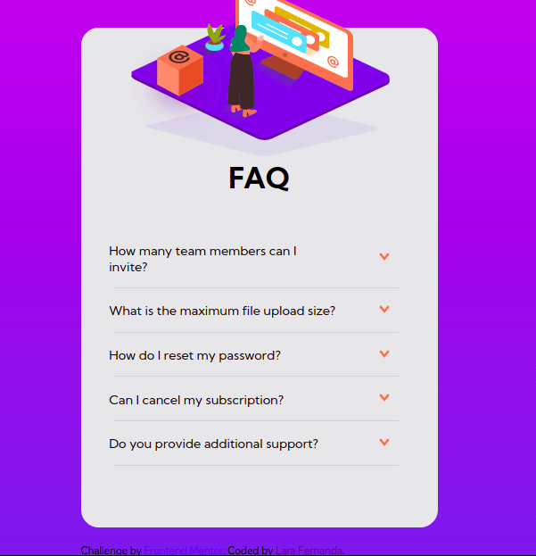

# FAQ Accordion Card

## Web


## Mobile


# Tecnologias

<ul>
    <li>ReactJS</li>
    <li>Pré-processador Sass</li>
    <li>JavaScript</li>
</ul>

# Como executar

Clone o projeto em seu dispositivo e acesse a pasta do mesmo.

```
$ git clone
$ cd
$ code .  (Abrir o Visual Studio Code)
```

Logo em seguida, o projeto estará em seu editor para ser executado.

# Projeto

FAQ Accordion Card é um desafio da plataforma FrontendMentor, que tem o objetivo de treinar os conceitos Frontend. E para que essa página fosse desenvolvida, foi utilizado ReactJS juntamento com o JavaScript e o Sass(Pré-processador CSS).

# Autor

Lara Fernanda

# Licença

Este projeto está sob a licença MIT -